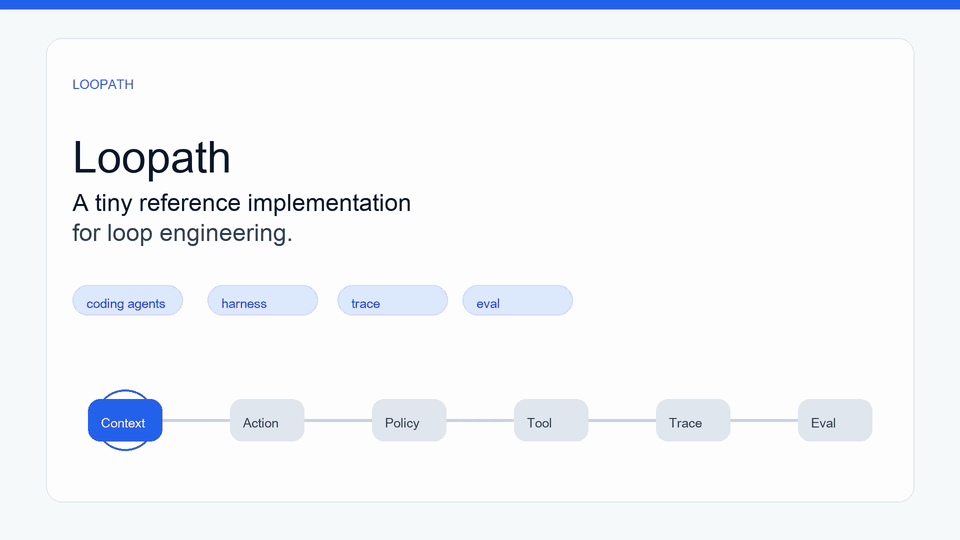

# Loopath

**A bilingual interactive skill for learning loop engineering.**

Loopath is a tiny reference implementation and conversational course for understanding the harness around coding agents: how context is built, how model output becomes structured action, how tools are gated by policy, how observations are traced, and how evals decide whether the loop should continue.

It is designed to be installed as an agent skill. Give this GitHub repo to your agent, install it, then let the agent guide you through the course one small topic at a time.

## Intro Video



The GIF above plays directly in the GitHub README. For the music-backed version, [watch the MP4 intro](https://github.com/encircleacity2/loopath/blob/main/media/intro/loopath-intro.mp4).

The MP4 has no TTS narration. It uses generated background music and motion-graphic frames to preview the course.

## What Loopath Teaches

Loopath focuses on the runtime around the model:

- context building
- structured model actions
- tool execution boundaries
- policy checks
- agent loop control
- trace logging
- evals and verification
- self-repair and reviewer patterns

The core loop:

```text
context -> action -> policy -> tool -> observation -> trace -> eval
```

## Use It as a Skill

Install this repository as a skill in your agent environment, then start with:

```text
Use $loopath to start the Loopath course.
```

The skill will:

- choose English or Chinese based on your conversation language
- show one small topic at a time
- explain the background, goal, and reason for each topic
- attach the matching explainer clip for the current language
- create lab files through the agent conversation
- run verification automatically after the lab
- show verification as a readable result card
- ask quiz questions one at a time and grade the answer

## Learning Flow

1. Start the course with `$loopath`.
2. Read one topic card.
3. Watch the matching explainer clip.
4. Ask follow-up questions or continue.
5. Let the agent create the lab files with you.
6. Run verification and inspect the result card.
7. Answer quiz questions one by one.

## Course Materials

- [Full course draft](course/loopath-course.md)
- [Chinese teaching notes](references/episode-01.zh.md)
- [English teaching notes](references/episode-01.en.md)
- [Lab verifier](labs/lab01/verify.py)

<details>
<summary>Optional local commands for maintainers</summary>

Start the course:

```bash
python3 scripts/loopath.py start --lang en
```

Show a step:

```bash
python3 scripts/loopath.py step --episode 1 --step 1 --lang en
```

Create the lab:

```bash
python3 scripts/loopath.py lab-create --episode 1 --repo ./loopath-dev --lang en
```

Run verification:

```bash
python3 scripts/loopath.py verify --episode 1 --repo ./loopath-dev --lang en
```

Ask and grade a quiz question:

```bash
python3 scripts/loopath.py quiz --episode 1 --question 1 --lang en
python3 scripts/loopath.py grade --episode 1 --question 1 --answer "B" --lang en
```

</details>

## Status

Early interactive skill version. The first learning path is implemented end-to-end; more learning paths will be added incrementally.

## License

MIT.

---

# Loopath 中文说明

**一个用于学习 loop engineering 的中英双语互动 skill。**

Loopath 是一个小型参考实现，也是一套可以由 agent 对话式引导的课程。它关注 coding agent 背后的 harness：如何构建 context，如何把模型输出变成结构化 action，如何用 policy 控制工具执行，如何记录 observation 和 trace，以及如何用 eval 判断 loop 是否继续。

它的定位不是普通课程文档，而是可安装到 agent 里的学习 skill。把这个 GitHub repo 给到 agent 安装后，就可以让 agent 一次带你学一个小课题。

## 介绍视频


上面的 GIF 会直接在 GitHub README 中播放。需要带音乐的版本，可以[观看 MP4 介绍视频](https://github.com/encircleacity2/loopath/blob/main/media/intro/loopath-intro.mp4)。

MP4 没有 TTS 配音，使用生成式背景音乐和 motion graphic 画面预览课程内容。

## Loopath 会教什么

Loopath 重点讲模型外面的 runtime：

- context 构建
- 结构化 action
- tool 执行边界
- policy 检查
- agent loop 控制
- trace 记录
- eval 和 verification
- self-repair 和 reviewer patterns

核心循环：

```text
context -> action -> policy -> tool -> observation -> trace -> eval
```

## 作为 Skill 使用

安装这个 GitHub repo 后，可以这样启动：

```text
Use $loopath to start the Loopath course.
```

这个 skill 会：

- 根据你的对话语言选择中文或英文
- 每次只展示一个小课题
- 解释每个小课题的背景、目的和原因
- 根据语言附上对应的 explainer clip
- 在 agent 对话中创建 lab 文件
- 在 lab 完成后自动运行 verification
- 用检测结果卡片展示验收结果
- 一次问一道 quiz，并给出评分和参考答案

## 学习流程

1. 用 `$loopath` 启动课程。
2. 阅读一个小课题卡片。
3. 观看对应的 explainer clip。
4. 提问，或者继续下一节。
5. 让 agent 和你一起创建 lab 文件。
6. 运行 verification，查看检测结果卡片。
7. 一问一答完成 quiz。

## 课程材料

- [完整课程草稿](course/loopath-course.md)
- [中文教学参考](references/episode-01.zh.md)
- [英文教学参考](references/episode-01.en.md)
- [Lab 验收脚本](labs/lab01/verify.py)

<details>
<summary>维护者可选本地命令</summary>

启动课程：

```bash
python3 scripts/loopath.py start --lang zh
```

展示一个 step：

```bash
python3 scripts/loopath.py step --episode 1 --step 1 --lang zh
```

创建 lab：

```bash
python3 scripts/loopath.py lab-create --episode 1 --repo ./loopath-dev --lang zh
```

运行验收：

```bash
python3 scripts/loopath.py verify --episode 1 --repo ./loopath-dev --lang zh
```

提问并评分：

```bash
python3 scripts/loopath.py quiz --episode 1 --question 1 --lang zh
python3 scripts/loopath.py grade --episode 1 --question 1 --answer "B" --lang zh
```

</details>

## 当前状态

早期互动 skill 版本。第一条学习路径已经端到端实现，后续学习路径会逐步加入。
