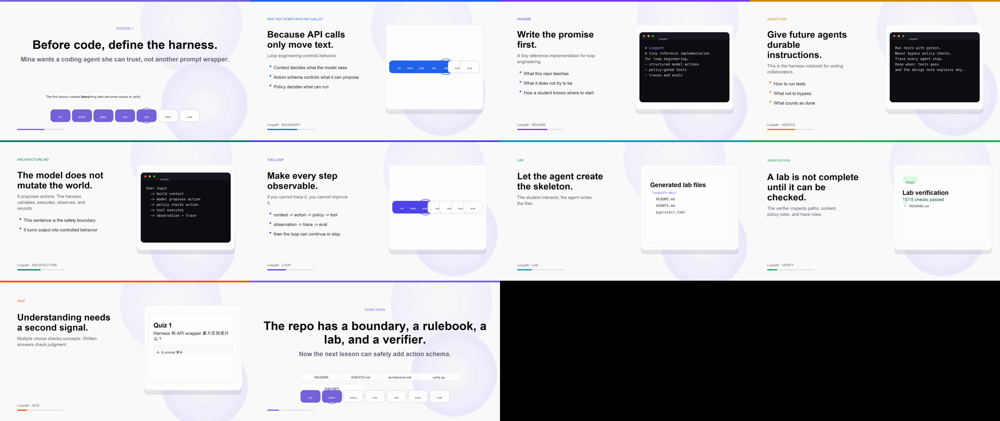

# Loopath

**A tiny reference implementation for loop engineering.**

Loopath is a 0-to-1 teaching project for people who use coding agents and want to understand the runtime underneath them.

The goal is similar in spirit to `nanoGPT`: keep the project small enough to read, but real enough to explain the core engineering ideas behind modern coding-agent loops.

## What Loopath Teaches

Loopath focuses on the harness around the model:

- structured model actions
- tool execution boundaries
- policy checks
- agent loop control
- trace logging
- evals and verification
- loop engineering experiments
- self-repair and reviewer patterns

The core idea:

```text
context -> action -> policy -> tool -> observation -> trace -> eval
```

## Course

The full course draft is here:

- [course/loopath-course.md](course/loopath-course.md)

The course is designed as a practical lab sequence. Each lesson includes:

- guided implementation steps
- self-verification commands
- agent-verifier prompts
- quiz questions at multiple difficulty levels
- grading rubrics for open-ended answers

## Lab Verifiers

Lab verifiers live in `labs/`.

For example, to verify a student's Lab 1 project:

```bash
python3 labs/lab01/verify.py --repo /path/to/student/loopath
```

Or:

```bash
make verify-lab1 REPO=/path/to/student/loopath
```

## Episode 1 Preview

Episode 1 introduces the project boundary and walks through Lab 1.

- [Episode 1 video](media/loopath-episode-01.mp4)
- [Episode 1 storyboard](video/episode-01/storyboard.md)
- [Episode 1 narration](video/episode-01/narration.txt)



## Lab 1 Output

The first lab creates the project skeleton:

```text
loopath/
  README.md
  AGENTS.md
  pyproject.toml
  src/loopath/
  tests/
  demo_repos/
  prompts/
  evals/
  traces/
  docs/
```

Lab 1 is complete only when both human and agent verification can pass:

```text
Lab 1 verification passed
```

## Positioning

Loopath is not trying to be a full agent framework.

It is a teaching reference: small, inspectable, and designed to make the loop visible.

## Status

Early course draft. The repo currently contains the course plan and Episode 1 explainer assets. Implementation labs will be added incrementally.

## License

MIT.
