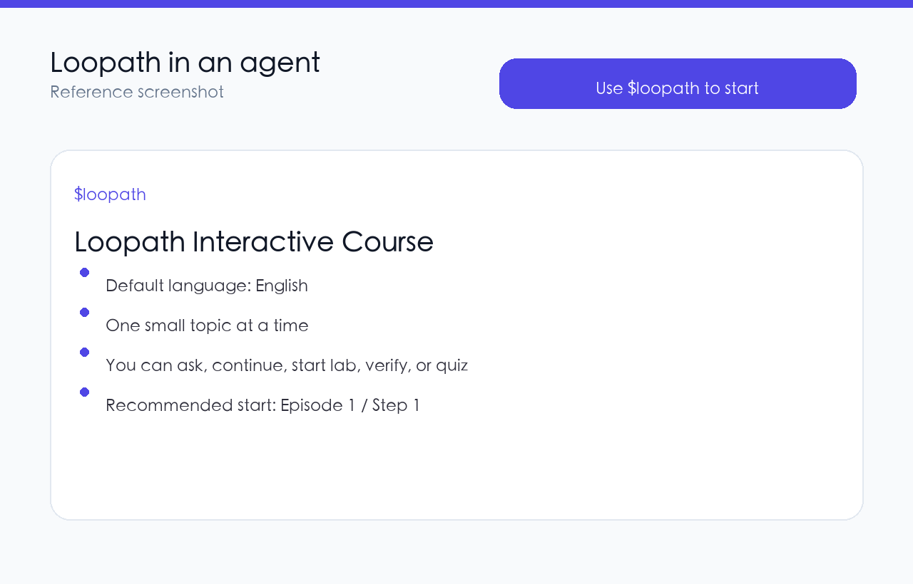
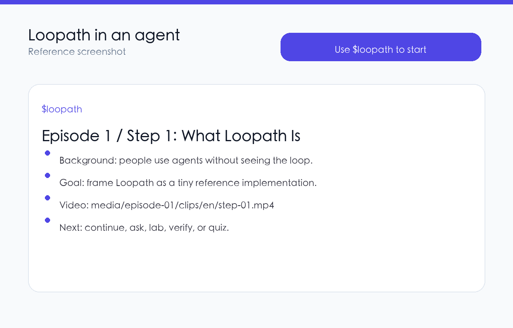
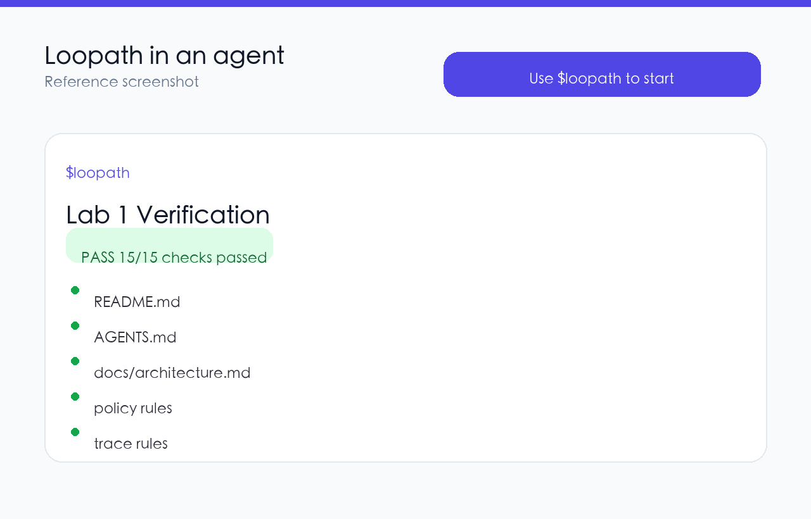
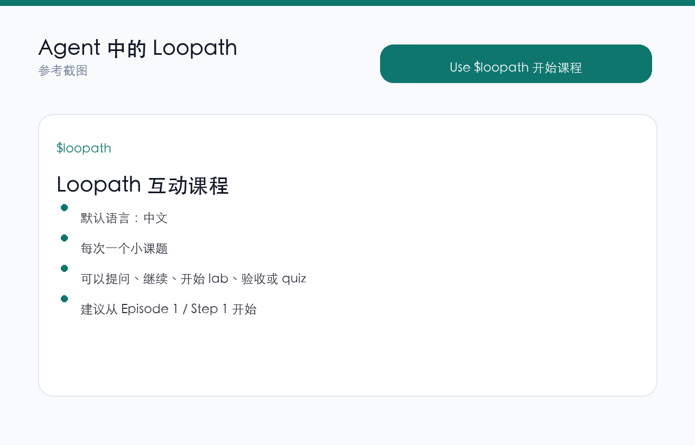
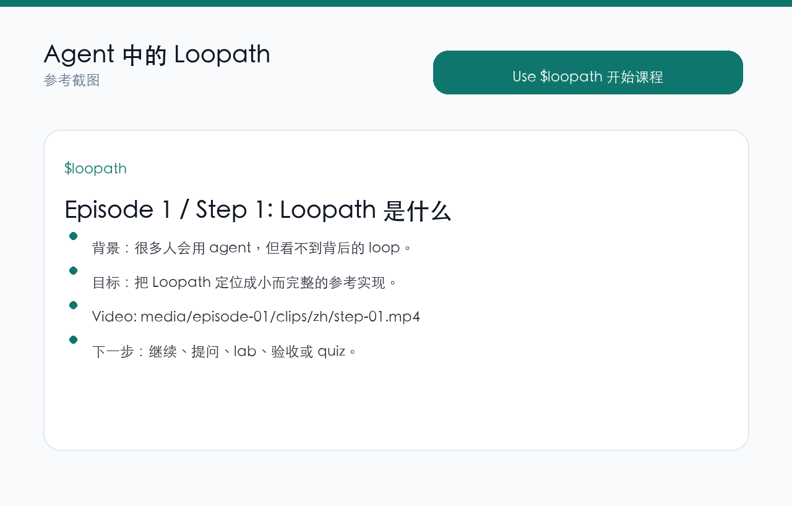
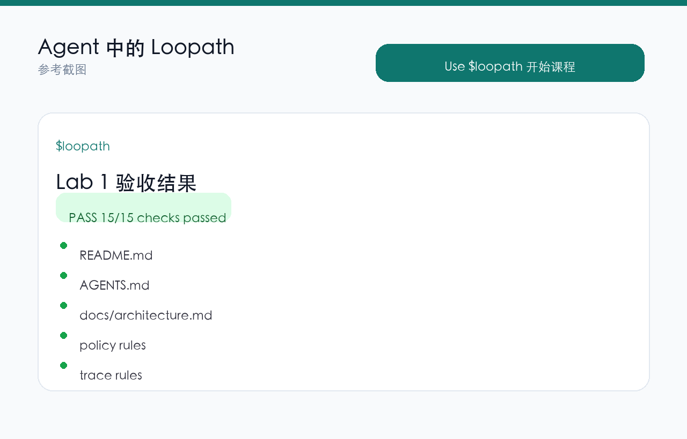

# Loopath

**A bilingual interactive skill for learning loop engineering inside an agent.**

Loopath is a small reference course for understanding the harness around coding agents: context building, structured actions, policy-gated tools, observations, traces, verification, and evals.

It is meant to be installed as an agent skill. After installation, the agent guides you one step at a time. Each step includes a short text card and a matching clip under `media/episode-XX/clips/`.

## Getting Started

Install the skill:

```bash
git clone https://github.com/encircleacity2/loopath ~/.codex/skills/loopath
```

For Claude Code:

```bash
git clone https://github.com/encircleacity2/loopath ~/.claude/skills/loopath
```

Restart your agent session, then say:

```text
Use $loopath to start the Loopath course.
```

The skill will detect your conversation language, show one small topic at a time, and include the matching step clip path:

```text
media/episode-01/clips/en/step-01.mp4
media/episode-01/clips/zh/step-01.mp4
media/episode-14/clips/en/step-05.mp4
```

## What You Should See







## Learning Flow

1. Start with `$loopath`.
2. Read the current step card.
3. Watch the matching clip.
4. Ask questions or continue to the next step.
5. Let the agent create the lab files.
6. Run verification and inspect the result card.
7. Answer quiz questions one at a time.

## Course Materials

- [Full course draft](course/loopath-course.md)
- [English teaching notes](references/episode-01.en.md)
- [Chinese teaching notes](references/episode-01.zh.md)
- Episode clips: `media/episode-01/` through `media/episode-14/`
- Clip coverage: Episode 1 has 14 bilingual steps; Episodes 2-14 have 5 bilingual steps each.
- [Lab verifier](labs/lab01/verify.py)

<details>
<summary>Optional local commands for maintainers</summary>

Start the course:

```bash
python3 scripts/loopath.py start --lang en
```

Show a step:

```bash
python3 scripts/loopath.py step --episode 1 --step 1 --lang en
python3 scripts/loopath.py step --episode 14 --step 5 --lang en
```

Create the lab:

```bash
python3 scripts/loopath.py lab-create --episode 1 --repo ./loopath-dev --lang en
```

Run verification:

```bash
python3 scripts/loopath.py verify --episode 1 --repo ./loopath-dev --lang en
```

Ask and grade a quiz question:

```bash
python3 scripts/loopath.py quiz --episode 10 --question 1 --lang en
python3 scripts/loopath.py grade --episode 10 --question 1 --answer "B" --lang en
```

</details>

## Current Scope

The interactive skill currently includes step cards, bilingual clips, and quiz grading for Episodes 1-14. Lab creation and automated verification are implemented for Lab 1.

## License

MIT.

---

# Loopath 中文说明

**一个在 agent 里学习 loop engineering 的中英双语互动 skill。**

Loopath 是一套小型参考课程，用来理解 coding agent 背后的 harness：context 构建、结构化 action、policy-gated tools、observation、trace、verification 和 eval。

它的定位是可安装到 agent 里的学习 skill。安装后，agent 会一次带你学习一个小课题。每个 step 都有文字卡片，也有对应的短 clip，路径在 `media/episode-XX/clips/`。

## Getting Started / 快速开始

安装到 Codex：

```bash
git clone https://github.com/encircleacity2/loopath ~/.codex/skills/loopath
```

安装到 Claude Code：

```bash
git clone https://github.com/encircleacity2/loopath ~/.claude/skills/loopath
```

重启 agent session，然后输入：

```text
Use $loopath to start the Loopath course.
```

skill 会根据你的对话语言选择中文或英文，每次展示一个小课题，并返回对应 step clip：

```text
media/episode-01/clips/zh/step-01.mp4
media/episode-01/clips/en/step-01.mp4
media/episode-14/clips/zh/step-05.mp4
```

## Agent 中的参考截图







## 学习流程

1. 用 `$loopath` 启动课程。
2. 阅读当前 step 卡片。
3. 观看对应 clip。
4. 提问，或者继续下一步。
5. 让 agent 创建 lab 文件。
6. 运行 verification，查看检测结果卡片。
7. 一问一答完成 quiz。

## 课程材料

- [完整课程草稿](course/loopath-course.md)
- [英文教学参考](references/episode-01.en.md)
- [中文教学参考](references/episode-01.zh.md)
- Episode clips：`media/episode-01/` 到 `media/episode-14/`
- Clip 覆盖：Episode 1 有 14 个双语 steps；Episode 2-14 每集有 5 个双语 steps。
- [Lab 验收脚本](labs/lab01/verify.py)

<details>
<summary>维护者可选本地命令</summary>

启动课程：

```bash
python3 scripts/loopath.py start --lang zh
```

展示一个 step：

```bash
python3 scripts/loopath.py step --episode 1 --step 1 --lang zh
python3 scripts/loopath.py step --episode 14 --step 5 --lang zh
```

创建 lab：

```bash
python3 scripts/loopath.py lab-create --episode 1 --repo ./loopath-dev --lang zh
```

运行验收：

```bash
python3 scripts/loopath.py verify --episode 1 --repo ./loopath-dev --lang zh
```

提问并评分：

```bash
python3 scripts/loopath.py quiz --episode 10 --question 1 --lang zh
python3 scripts/loopath.py grade --episode 10 --question 1 --answer "B" --lang zh
```

</details>

## 当前范围

互动 skill 目前覆盖 Episode 1-14 的 step 卡片、双语 clips 和 quiz 评分。Lab 创建与自动 verification 目前实现到 Lab 1。
