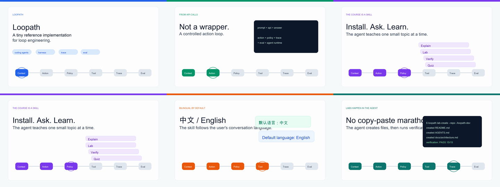

# Loopath

**An interactive bilingual skill for learning loop engineering.**

Loopath is a tiny reference implementation and conversational course for understanding the runtime behind coding agents.

It is designed to be installed as an agent skill: give the GitHub repo to your agent, install it, then let the agent guide you through the course one small topic at a time.

## Intro Video

[Watch the intro video](media/intro/loopath-intro.mp4)



The intro video has no TTS narration. It uses generated background music and motion-graphic frames to preview what the course covers.

## What Loopath Teaches

Loopath focuses on the harness around the model:

- structured model actions
- tool execution boundaries
- policy checks
- agent loop control
- trace logging
- evals and verification
- loop engineering experiments
- self-repair and reviewer patterns

The core loop:

```text
context -> action -> policy -> tool -> observation -> trace -> eval
```

## Install as a Skill

Install this repository as a skill in your agent environment, then start with:

```text
Use $loopath to start the Loopath course.
```

The skill supports:

- English and Chinese language selection based on the conversation language
- one-step-at-a-time episode navigation
- per-step explainer clips in both languages
- agent-created lab files
- automatic verification cards
- one-question-at-a-time quizzes with grading

## Interactive Usage

Start the course:

```bash
python3 scripts/loopath.py start --lang en
```

Show a specific step:

```bash
python3 scripts/loopath.py step --episode 1 --step 1 --lang en
```

Create Lab 1 through the agent:

```bash
python3 scripts/loopath.py lab-create --episode 1 --repo ./loopath-dev --lang en
```

Run verification:

```bash
python3 scripts/loopath.py verify --episode 1 --repo ./loopath-dev --lang en
```

Ask a quiz question:

```bash
python3 scripts/loopath.py quiz --episode 1 --question 1 --lang en
```

Grade an answer:

```bash
python3 scripts/loopath.py grade --episode 1 --question 1 --answer "B" --lang en
```

## Episode 1

Episode 1 introduces the project boundary and walks through Lab 1.

- [Long-form Episode 1 video](media/loopath-episode-01.mp4)
- [Chinese step clips](media/episode-01/clips/zh/)
- [English step clips](media/episode-01/clips/en/)
- [Episode 1 storyboard](video/episode-01/storyboard.md)
- [Episode 1 narration](video/episode-01/narration.txt)


## Course Draft

- [Full course draft](course/loopath-course.md)
- [Episode 1 Chinese reference](references/episode-01.zh.md)
- [Episode 1 English reference](references/episode-01.en.md)

## Lab Verifiers

Lab verifiers live in `labs/`.

```bash
python3 labs/lab01/verify.py --repo /path/to/student/loopath
```

Or:

```bash
make verify-lab1 REPO=/path/to/student/loopath
```

## Status

Early interactive skill version. Episode 1 is implemented end-to-end; later episodes will be added incrementally.

## License

MIT.

---

# Loopath 中文说明

**一个用于学习 loop engineering 的中英双语互动 skill。**

Loopath 不是单纯的课程文档，而是一个可以安装到 agent 里的对话式学习 skill。用户把 GitHub 链接给到 agent 安装后，可以让 agent 一步一步引导学习 coding agent 背后的 runtime 和 harness 设计。

## 介绍视频

[查看介绍视频](media/intro/loopath-intro.mp4)


介绍视频没有 TTS 配音，使用生成式背景音乐和 motion graphic 画面展示课程亮点。

## 课程会覆盖什么

Loopath 重点讲模型外面的 harness：

- 结构化 action
- tool 执行边界
- policy 检查
- agent loop 控制
- trace 记录
- eval 和 verification
- loop engineering 实验
- self-repair 和 reviewer patterns

核心循环：

```text
context -> action -> policy -> tool -> observation -> trace -> eval
```

## 作为 Skill 使用

安装这个 GitHub repo 后，可以这样启动：

```text
Use $loopath to start the Loopath course.
```

它支持：

- 根据用户对话语言自动选择中文或英文
- 每次只讲一个小课题
- 每个 step 提供中英文 explainer clip
- 在 agent 对话中创建 lab 文件
- 自动运行 verification，并输出检测结果卡片
- quiz 一问一答，并给出评分和参考答案

## 交互命令

启动课程：

```bash
python3 scripts/loopath.py start --lang zh
```

展示某个 step：

```bash
python3 scripts/loopath.py step --episode 1 --step 1 --lang zh
```

通过 agent 创建 Lab 1：

```bash
python3 scripts/loopath.py lab-create --episode 1 --repo ./loopath-dev --lang zh
```

运行验收：

```bash
python3 scripts/loopath.py verify --episode 1 --repo ./loopath-dev --lang zh
```

开始 quiz：

```bash
python3 scripts/loopath.py quiz --episode 1 --question 1 --lang zh
```

给答案评分：

```bash
python3 scripts/loopath.py grade --episode 1 --question 1 --answer "B" --lang zh
```

## Episode 1

Episode 1 介绍项目边界，并完成 Lab 1。

- [Episode 1 完整视频](media/loopath-episode-01.mp4)
- [中文 step clips](media/episode-01/clips/zh/)
- [英文 step clips](media/episode-01/clips/en/)
- [Episode 1 storyboard](video/episode-01/storyboard.md)
- [Episode 1 narration](video/episode-01/narration.txt)


## 课程文档

- [完整课程草稿](course/loopath-course.md)
- [Episode 1 中文参考](references/episode-01.zh.md)
- [Episode 1 英文参考](references/episode-01.en.md)

## Lab 验收

Lab verifier 放在 `labs/` 目录。

```bash
python3 labs/lab01/verify.py --repo /path/to/student/loopath
```

也可以：

```bash
make verify-lab1 REPO=/path/to/student/loopath
```

## 当前状态

早期互动 skill 版本。Episode 1 已经端到端实现，后续 episode 会逐步加入。
